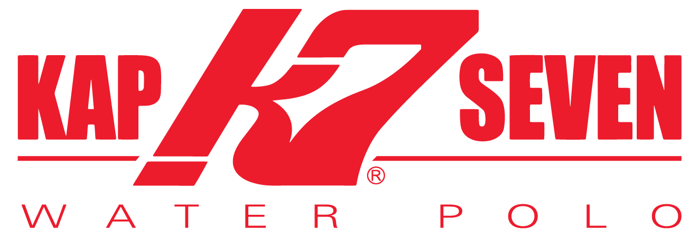

# **2025 LEAGUE SPONSORSHIPS AVAILABLE**

Our mission is to provide opportunities for athletes, coaches, and referees to grow and develop here in Utah. 

Water polo is a more than just a game; it is a full-body sport that challenges both the athlete’s mental and physical endurance. 

Utah Water Polo Association is committed to raising the level of play for all ages of athletes. To do this, we need The game of water polo has been a close knit community her

OUR GOALS

- Increase playing opportunities for our local athletes and league.

- Gain more exposure for the league on a statewide and national scale.

- Grow the sport here in Utah by providing more financially feasible clinics with top tier coaching.

- Create an incredible environment for our athletes, coaches, referees to learn and grow!

# **CURRENT LEAGUE SPONSORS**

# BUILT BY WATER POLO PLAYERS

**OUR MISSION**

We are childhood friends, age group teammates, and Olympic team members and water polo has and always will be a part of who we are. Growing up, water polo gear was hard to come by so we came up with the idea of making it more accessible, and KAP7 was born. Our mission is to positively impact the development of the sport by growing the community worldwide, creating best in class events and educational programs, and providing the highest quality water polo gear on the market.

We want to thank you for your support and trust in KAP7, we couldn’t have done it without you; the water polo community. Because water polo means so much to us, we created a program where we give back a portion of every sale to the sport.

**Bradley Schumacher: President, Founder, 2 Sport Olympian + 2X Olympic Gold Medalist**

**Wolf Wigo: KAP7 Vice President, Founder, 3X Olympian, 2X World Champion, 2004 Olympic Team Captain**

 

